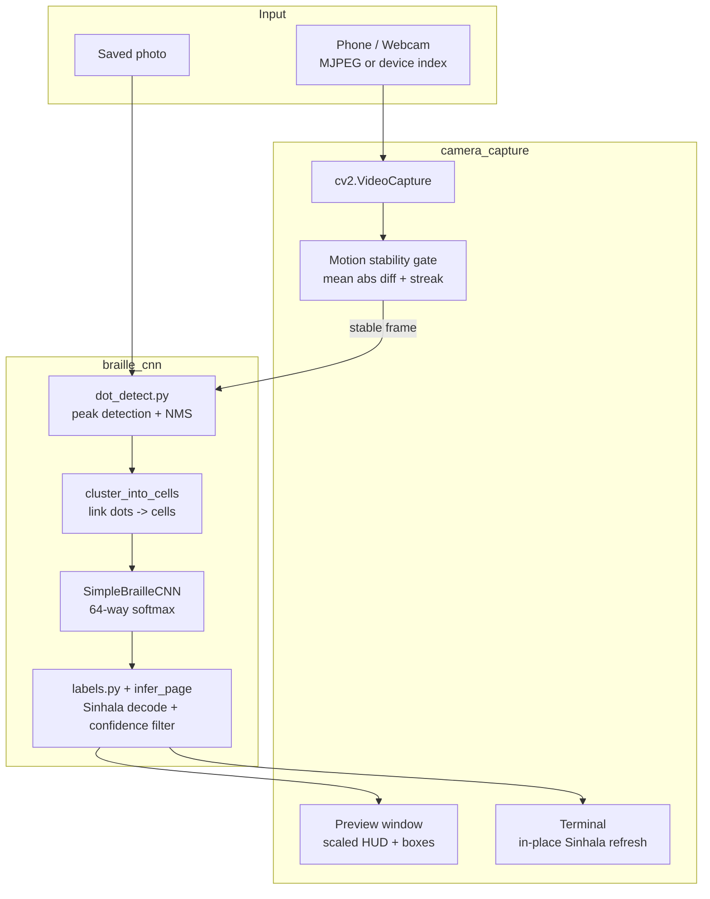

# BrailleLens

Real-time Braille page recognition for **Sinhala** output. A phone or webcam captures a Braille page, the system detects embossed dots, classifies each 6-dot cell with a CNN, and prints the decoded Sinhala text in the terminal.

---

## Quick Start — Live Camera Test

Use **Python 3.11** (PyTorch is installed there on this project):

```bash
# 1. Install dependencies (once)
py -3.11 -m pip install -r braille_cnn/requirements.txt

# 2. Train or obtain the model checkpoint (once — skip if file already exists)
py -3.11 -m braille_cnn.finetune_dbsi --scratch --dbsi-root "data DBSI/data"

# 3. Start IP Webcam on your phone (same Wi-Fi as PC), note the URL shown in the app

# 4. Run live camera mode from the project root
py -3.11 camera_capture/run_camera.py --source http://YOUR_PHONE_IP:8080/video
```

**What to expect:**
- A preview window opens (`BrailleLens — Live Camera`)
- Hold the camera over a Braille page until the bar turns **green (STABLE)**
- **Sinhala text appears in the terminal** (updates in place)
- Press **`S`** to force one inference, **`Q`** to quit

**Preview-only** (test stream connection without loading the model):

```bash
py -3.11 camera_capture/run_camera.py --source http://YOUR_PHONE_IP:8080/video --preview-only
```

**Important:** Use `py -3.11`, not plain `python`, if your default Python lacks PyTorch.

---

## Static Image Test (no camera)

```bash
py -3.11 -m braille_cnn.infer_page --auto --image test-img.jpeg --lang si
```

Add `--debug-out debug.png` to save an overlay showing detected dot clusters and crop boxes.

If classical dot finding is weak, retry with YOLO transfer learning (same CNN):

```bash
py -3.11 -m braille_cnn.infer_page --auto --image test-img.jpeg --lang si --dot-backend auto
```

---

## Prerequisites

| Requirement | Notes |
|-------------|-------|
| Python 3.11 | PyTorch + OpenCV installed |
| DBSI dataset | Clone into `data DBSI/` (see [Dataset setup](#dataset-setup)) |
| Trained checkpoint | `braille_cnn/checkpoints/braille_cnn_dbsi_finetuned.pt` (gitignored — train locally) |
| IP Webcam app | For phone-as-camera testing (or use `--source 0` for built-in webcam) |

### Dataset setup

```bash
git clone https://github.com/yeluo1994/DSBI "data DBSI"
copy "data DBSI\train.txt" "data DBSI\data\train.txt"
copy "data DBSI\test.txt"  "data DBSI\data\test.txt"
```

Training reads from `--dbsi-root "data DBSI/data"` because page images live under `data/` while split files sit at the clone root.

---

## Project stages

Train on **DSBI + Angelina** first. Label Gold and fine-tune last.

| Stage | Folder | What it does |
|---|---|---|
| 1 Collection | `data DBSI/`, `data Angelina/`, `Gold Dataset/` | Already on disk. Gold labels come later. |
| 2a Integrate | [`data_pipeline/integrate.py`](data_pipeline/integrate.py) | Three formats → one cell CSV |
| 2b Clean | [`data_pipeline/clean.py`](data_pipeline/clean.py) | Drop bad boxes; write `reports/cleaning_log.md` |
| 2c Reduce | [`data_pipeline/reduce.py`](data_pipeline/reduce.py) | 64×64 crop archives |
| 2d Transform | [`data_pipeline/transform.py`](data_pipeline/transform.py) | Normalize + augment at load time |
| 3 EDA | [`data_pipeline/analyze.py`](data_pipeline/analyze.py) | `reports/eda/` |
| 4a Detect cells | [`cell_detect/`](cell_detect) | Single-class YOLO (train on Colab) |
| 4b Classify cells | [`braille_cnn/train_classifier.py`](braille_cnn/train_classifier.py) | 64-class CNN on the crop archives |
| 4e Recognise page | [`braille_cnn/recognize.py`](braille_cnn/recognize.py) | `recognize_page(image, backend="cells"\|"dots")` |
| 5 Live app | [`finger_cell_track/`](finger_cell_track) | Auto-scan + fingertip → one character |
| 6 Evaluate | `braille_cnn/eval_*.py`, `cell_detect/evaluate_detector.py` | Accuracy / mAP / end-to-end |

Handoff between data and models: `data_pipeline/manifests/manifest_clean.csv`.

```
BrailleLens/
├── data_pipeline/             <- Stages 1–3 (manifest, crops, EDA)
├── cell_detect/               <- Stage 4a cell YOLO (not dots)
├── braille_cnn/               <- Stage 4b/4e 64-class CNN + recognize_page
├── yolo_dot_detect/           <- Dot YOLO fallback / baseline
├── camera_capture/            <- Live page demo of the CNN
├── finger_cell_track/         <- Stage 5 fingertip learning app
├── reports/                   <- Stage 3 + 6 artefacts
├── data DBSI/                 <- Scanner dataset (gitignored)
├── data Angelina/             <- Handheld dataset (gitignored)
├── Gold Dataset/              <- Sinhala pages; label later (Stage 1b)
├── braille_lens_flutter/      <- Mobile app (untouched)
├── braille_app_pipeline/      <- App helper (untouched)
├── docs/
└── experiments/               <- Not the deployment path
```

Read [`data_pipeline/README.md`](data_pipeline/README.md) and [`cell_detect/README.md`](cell_detect/README.md) before training.

Dot finding in the old page CLI still defaults to classical peaks. Pass `--dot-backend yolo` or `auto` on `braille_cnn.infer_page`. The new path is cell boxes + CNN via `recognize_page`.

---

## Architecture



### Pipeline stages (technical)

1. **Frame capture** — OpenCV reads BGR frames; full resolution is kept for inference.
2. **Motion gate** — Mean absolute pixel difference between consecutive grayscale frames; requires N stable frames before auto-inference (reduces flicker).
3. **Dot detection** — Gaussian-blur difference + percentile threshold finds embossed dot peaks; non-max suppression removes duplicates.
4. **Cell clustering** — Nearby dots linked into 6-dot Braille cells; ambiguous merges flagged and skipped.
5. **CNN classification** — Each cell crop (64x64 grayscale) -> 64-class softmax; model loaded **once** at startup.
6. **Line grouping** — Cluster centres grouped into reading-order lines using vertical gap analysis (Otsu on y-gaps).
7. **Sinhala decoding** — Single-cell lookup + two-cell indicator vowel pairs; low-confidence cells shown as `_`.
8. **Output** — Sentence printed to terminal with `\r` in-place refresh; preview shows ASCII stats only (OpenCV cannot render Sinhala on Windows).

### CNN summary

| Property | Value |
|----------|-------|
| Input | `(B, 1, 64, 64)` float32 grayscale [0, 1] |
| Output | 64 logits -> softmax -> Braille dot-pattern code (0-63) |
| Training data | Synthetic renderer + DBSI flatbed scans |
| DBSI test accuracy | ~99% (flatbed scans — see `braille_cnn/RESULTS.md`) |
| Default checkpoint | `braille_cnn_dbsi_finetuned.pt` |

---

## What Is Completed

| Area | Status | Key files |
|------|--------|-----------|
| CNN model | Done | `braille_cnn/cnn.py` |
| Synthetic training | Done | `braille_cnn/train.py` — 100% on synthetic test |
| DBSI training / fine-tune | Done | `braille_cnn/finetune_dbsi.py` — ~99% on DBSI test set |
| Dot detection & clustering | Done | `braille_cnn/dot_detect.py` |
| Static page inference | Done | `braille_cnn/infer_page.py --auto` |
| Sinhala label table | Done (needs native review) | `braille_cnn/labels.py`, `check_labels.py` |
| **Branch 2 — Live camera** | **Done** | `camera_capture/` — VideoCapture, motion gate, PIL conversion |
| **Branch 3 — Live Sinhala output** | **Done** | Confidence threshold, in-place terminal, default `--lang si` |
| Model load once (Bug 4 fix) | Done | `load_model()` + `weights_only=True` |
| Flutter mobile app | Prototype | `braille_lens_flutter/` — ONNX on-device (separate from Python pipeline) |

---

## What's Left To Do

| Priority | Task | Why |
|----------|------|-----|
| High | **Fine-tune on phone-camera crops** | Model excels on flatbed scans but struggles on handheld IP Webcam footage (domain gap — see `RESULTS.md`) |
| High | **Native Sinhala reader review** of `CODE_TO_SINHALA` | Labels were transcribed from charts; verify before TTS or production use |
| Medium | Wire `--debug-out` through live camera mode | Debug overlay PNG currently works for static `--image` mode only |
| Medium | Integrate live pipeline into Flutter app | Python camera module and Flutter ONNX stack are separate today |
| Medium | Text-to-speech for decoded Sinhala | `braille_app_pipeline/audio_engine.py` exists as early prototype |
| Low | Perspective-robust retraining | `eval_perspective.py` shows ~13 pt drop under synthetic skew |
| Low | Update `experiments/IMPLEMENTATION_PLAN.md` | Still lists Branch 2/3 as pending |

---

## Common Commands

### Training

```bash
# Synthetic pretrain (optional — fine-tune path also supports --scratch)
py -3.11 -m braille_cnn.train

# DBSI from scratch (what we used for the current checkpoint)
py -3.11 -m braille_cnn.finetune_dbsi --scratch --dbsi-root "data DBSI/data" --epochs 15

# Fine-tune from synthetic checkpoint
py -3.11 -m braille_cnn.finetune_dbsi --dbsi-root "data DBSI/data" --init-checkpoint braille_cnn/checkpoints/braille_cnn_best.pt --lr 1e-4
```

### Evaluation

```bash
py -3.11 -m braille_cnn.eval_dbsi
py -3.11 -m braille_cnn.eval_angelina
py -3.11 -m braille_cnn.eval_gold          # no-op until Gold is labelled
py -3.11 -m braille_cnn.check_labels
```

### Current training path (DSBI + Angelina)

```bash
py -3.11 -m data_pipeline.integrate --sources dbsi angelina --split-mode rebalance
py -3.11 -m data_pipeline.clean
py -3.11 -m data_pipeline.analyze
py -3.11 -m data_pipeline.reduce
py -3.11 -m cell_detect.prepare_cell_dataset
py -3.11 -m braille_cnn.train_classifier --smoke-test
```

Real YOLO / CNN training needs a GPU (Colab). This PC is CPU-only. Hand
the other person **[`colab_training.md`](colab_training.md)** (Job A = cell
detector, Job B = CNN). Progress vs the build plan: [`PLAN_STATUS.md`](PLAN_STATUS.md).

### Live camera (tuning)

```bash
# Stricter confidence, more motion tolerance
py -3.11 camera_capture/run_camera.py --source http://192.168.x.x:8080/video --conf-threshold 0.75 --motion-threshold 10

# Full scroll log each frame
py -3.11 camera_capture/run_camera.py --source http://192.168.x.x:8080/video --verbose
```

### Camera controls (preview window)

| Key | Action |
|-----|--------|
| **Q** | Quit |
| **S** | Force inference on current frame |
| **D** | Toggle detection bounding boxes |

---

## Troubleshooting

| Problem | Solution |
|---------|----------|
| `ModuleNotFoundError: torch` | Use `py -3.11`, not conda env without PyTorch |
| `Checkpoint not found` | Run DBSI training (see above) |
| Preview looks zoomed | Default `--display-width 960` scales preview; inference uses full frame |
| Garbled text on video window | Normal — Sinhala renders in **terminal** only |
| `(no braille lines detected)` | Improve lighting, hold steady, press **S**, lower `--dot-percentile` |
| `#0` or `_` everywhere | Phone-camera domain gap or noisy detections — raise `--conf-threshold`, aim at real Braille |

---

## Further Reading

- [`camera_capture/README.md`](camera_capture/README.md) — Full camera module technical reference
- [`braille_cnn/README.md`](braille_cnn/README.md) — CNN architecture and Sinhala decoder details
- [`braille_cnn/RESULTS.md`](braille_cnn/RESULTS.md) — Experiment log and known domain gaps
- [`experiments/IMPLEMENTATION_PLAN.md`](experiments/IMPLEMENTATION_PLAN.md) — Original three-branch development plan

---

## Team / Course

CS3501 Data Science and Engineering Project — Group 15, BrailleLens.
