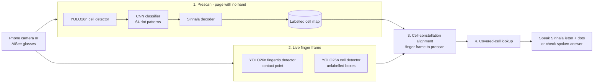

# BrailleLens

**An interactive Sinhala Braille learning system powered by AiSee smart glasses.**

A learner places an embossed Braille page in front of a phone camera or AiSee smart glasses and touches a cell. BrailleLens works out which cell is under the fingertip and speaks the Sinhala letter and its dot pattern. In Testing Mode the learner says the letter aloud and gets spoken feedback. Everything runs **on the device, offline**.

> 📄 **Paper accepted at the NeurIPS 2026 Global South AI Workshop.**

CS3501 Data Science and Engineering Project, **Group 15**:

| Member | Index |
|---|---|
| Himandhi Kuruppu | 230359M |
| Kalana Lakshan | 230365D |
| Hasini Lawanya | 230373B |

---

## Contents

- [Problem and motivation](#problem-and-motivation)
- [How it works](#how-it-works)
- [Mobile app](#mobile-app)
- [Models and results](#models-and-results)
- [Datasets](#datasets)
- [What's not in this branch](#whats-not-in-this-branch)
- [Repository layout](#repository-layout)
- [Getting started](#getting-started) (including [installing and using the app](#mobile-app-install-and-use-new-users))
- [Testing](#testing)
- [Limitations and next steps](#limitations-and-next-steps)
- [Team contributions](#team-contributions)
- [Acknowledgements](#acknowledgements)

---

## Problem and motivation

- **43.3 million** people worldwide were blind in 2020.
- Braille proficiency is essential for blind students to complete their O/L and A/L education.
- Learners need repeated practice with **immediate feedback**, but qualified Braille tutors and learning resources are scarce, especially in Sri Lanka and other low-resource settings.
- Existing tools don't fill this gap:

| System | What it does | Gap |
|---|---|---|
| Angelina Braille Reader | Open-source Braille OCR | Page-by-page transcription only; no interactive learning or spoken assessment |
| AI Braille Learning (Raspberry Pi) | Tactile servo output, offline speech | Needs dedicated Braille hardware |
| **BrailleLens** | Camera-based, standard embossed pages | Interactive Learning and Testing modes with Sinhala speech; needs only a camera |

---

## How it works


```mermaid
flowchart LR
    CAM[Phone camera or<br/>AiSee glasses] --> PRE

    subgraph PRE[1. Prescan - page with no hand]
        DET[YOLO26n cell detector] --> CNN[CNN classifier<br/>64 dot patterns] --> DEC[Sinhala decoder] --> MAP[(Labelled cell map)]
    end

    CAM --> LIVE

    subgraph LIVE[2. Live finger frame]
        TIP[YOLO26n fingertip detector<br/>contact point]
        CELLS[YOLO26n cell detector<br/>unlabelled boxes]
    end

    LIVE --> ALIGN[3. Cell-constellation alignment<br/>finger frame to prescan]
    MAP --> ALIGN
    ALIGN --> HIT[4. Covered-cell lookup]
    HIT --> OUT[Speak Sinhala letter + dots<br/>or check spoken answer]
```

1. **Prescan.** While the page is fully visible, a single-class **YOLO26-nano** detector finds every 6-dot cell. Each 64×64 crop goes through a **CNN** (64-class softmax, one class per dot pattern), and a **deterministic Sinhala decoder** turns the patterns into letters. The result is a labelled **cell map**.
2. **Live frame.** When the learner holds a finger on a cell, a fine-tuned **YOLO26n fingertip detector** finds the fingertip. Its contact point is the bottom-centre of the box, where the finger pad touches the page. The cell detector also runs on this frame to get unlabelled cell positions.
3. **Alignment.** The camera may have moved slightly since the prescan. `CellConstellationAligner` treats the cell centres in both images as landmarks:
   - it masks out cells under the hand;
   - it votes over scale, rotation and translation (Hough-style pose clustering);
   - it refines the best candidates with ICP and a least-squares similarity fit, with an optional affine correction.
   
   The output is a 3×3 transform from the finger frame to the prescan. If too few cells are visible, the app falls back to ORB-style keypoints with RANSAC homography, then to plain image scaling.
4. **Lookup.** The live box under the fingertip is matched one-to-one to its prescan cell. The letter comes from the prescan's labels. No classifier runs on the finger frame, because the finger covers the dots.

The Sinhala decoder works at **sequence level**: dependent vowel signs (*pillam*) span two cells, so a consonant cell and a vowel-sign cell combine into one syllable. Numbers and capital signs use the same one-cell lookahead.

---

## Mobile app

Flutter app in [`braille_lens_flutter/`](braille_lens_flutter). All models are ONNX files run with **ONNX Runtime** on the phone; there's no server and no network dependency.

### Modes

- **Learning Mode:**
  - the page is scanned automatically, with countdown beeps;
  - the learner holds a finger on a cell for about 3 seconds;
  - lock beeps play, then the app speaks the Sinhala letter and its dot numbers;
  - fully hands-free on the glasses.
- **Testing Mode:**
  - the app asks which letter is under the finger;
  - the learner answers aloud;
  - an on-device Sinhala speech model recognises the answer and gives spoken correct or incorrect feedback.
- **Voice commands:** Learning, Testing, Back, Retry, Help, Capture. Every screen can be operated without seeing it.

### Accessibility

- Dark, high-contrast theme with large full-screen touch zones.
- Works with standard mobile screen readers.
- Earcons and haptics for mic open and close, success and error.
- Offline Sinhala text-to-speech (`si-LK`) through the phone's speech engine, falling back to English when the Sinhala voice isn't installed. No large speech model is stored in the app.

### AiSee smart glasses

Glasses integration is complete. The phone camera and the AiSee capture path run through the **same live pipeline**. When the glasses are connected, their microphone and speaker are used; otherwise the app returns to the phone's own. Vendor-protocol details are in [`GLASSES_INTEGRATION_PLAN.md`](GLASSES_INTEGRATION_PLAN.md).

### Models bundled in the app

All are in `braille_lens_flutter/assets/models/` and selected in [`lib/config/app_config.dart`](braille_lens_flutter/lib/config/app_config.dart).

| Role | Active file | Size | Threshold |
|---|---|---|---|
| Cell detector | `braille_cell_yolo26n_lighting_mobile.onnx` (UINT8) | 3.2 MB | conf 0.40 |
| Cell classifier | `braille_cnn.onnx` + `braille_labels.json` | 0.6 MB | — |
| Fingertip detector | `fingertip_robust_yolo26n_mobile.onnx` (UINT8) | 2.7 MB | conf 0.35 |
| Spoken-letter recogniser | `sinhala_mms_small_int8.onnx` + `letters.json` | 49 MB | — |

On this branch the speech model, the FP32 fallbacks and the earlier models (`braille_cell_yolo26n[_degraded]`, `fingertip_braille_yolo26n`) are not included; see [What's not in this branch](#whats-not-in-this-branch). The thresholds to use for each earlier model are noted in `app_config.dart`.

**Export path:** PyTorch checkpoint → ONNX → bundled in assets → ONNX Runtime on device. `ClassifierService` mirrors the Python preprocessing (decode, grayscale, resize, normalise, softmax).

---

## Models and results

### 1. Cell detection: YOLO26-nano

- Single class, `braille_cell`; it only locates cells, and classification is a separate step.
- 1280 px input; up to 800 detections, covering the measured maximum of 623 cells per page.
- Trained on DSBI + Angelina (332 train / 56 val / 44 test pages) for 80 epochs on a Colab GPU, then fine-tuned on our Gold pages.
- YOLO26's **NMS-free end-to-end head** and direct L1 box regression (no DFL) keep it light for on-device export.
- Flips are disabled because they reduced Gold validation mAP50 from 0.81 to 0.32.

Progress on the Gold dataset:

| Stage | mAP@0.5 | Precision | Recall |
|---|---|---|---|
| 1. Base detector (DSBI + Angelina only) | 40.9% | 55.8% | 48.1% |
| 2. First Gold fine-tune | 37.6% | 57.8% | 58.9% |
| 3. + Colab GPU, + low-quality lighting pages | 65.3% | 73.0% | 74.4% |
| 4. + shear / perspective augmentation | 79.5% | 74.6% | 75.7% |
| 5. Same checkpoint, larger held-out test set | 80.8% | 75.3% | 79.5% |
| 6. + synthetic camera-degradation augmentation | **82.3%** | **80.8%** | **88.3%** |

**Closing the camera-domain gap:**
- AiSee photos are about 9–10× blurrier than our phone training photos and have a warm indoor colour cast.
- Two calibrated synthetic transforms (simulated blur and warm cast) **replace**, rather than add to, existing training images. This took mAP@0.5 from 80.8% to 82.3%, with gains on high-quality, low-light and blurred test pages. See [`cell_detect/CAMERA_DEGRADATION.md`](cell_detect/CAMERA_DEGRADATION.md).

**Lighting-robust model (active in the app):**
- The degraded model was further fine-tuned for dim light, side light, shadow, blur, glasses softness, colour temperature and glare, and on Braille-free negative images. Notebook: [`lighting_robust/BrailleLens_LightingRobust_Colab.ipynb`](lighting_robust/BrailleLens_LightingRobust_Colab.ipynb).
- Compared with the degraded model, it scores F1 **0.944 vs 0.875**, real low-light recall **0.978 vs 0.940**, and **5.9 vs 58.2** false boxes per Braille-free image.
- In dark conditions (severity 1), F1 rose from **0.11 to 0.84**.
- Full results are in [`lighting_robust/results/`](lighting_robust/results).

### 2. Cell classification: CNN

`SimpleBrailleCNN`: a 64×64 grayscale crop goes in, and a 64-class softmax over dot-pattern codes 0–63 comes out.

| Evaluation | Accuracy |
|---|---|
| Synthetic-only model, synthetic test | 100% |
| Same model, zero-shot on real DSBI scans | 51.2% |
| Fine-tuned on just 26 real pages, DSBI test | 98.44% |
| **DSBI test** (fine-tuned + per-crop normalisation) | **99.24%** (recto 99.33% / verso 99.16%) |
| **Angelina validation** (mixed-domain checkpoint) | **99.56%** (13,228 / 13,286) |
| Our phone-camera photos, before Gold fine-tuning | ~67.7% |
| **Gold held-out pages**, after Gold fine-tuning | **95.93%** |

What we learned: a small amount of real data closes almost the entire synthetic-to-real gap, so pretraining on synthetic data and then fine-tuning works. Per-crop normalisation fixed a real illumination gap and improved accuracy on every split.

### 3. Fingertip detection

Approaches we tried, in order:

1. **MediaPipe Hands** (landmark 8, index fingertip). Dropped because it needs the palm in view, and in a top-down Braille-reading view usually only the fingertip shows.
2. **SkinContours** (now the fallback):
   - build a skin mask;
   - find contour blobs;
   - keep the best finger-shaped blob that enters from the frame edge;
   - take the distal-pad contact point;
   - reject "ghost" tips near corners or margins.
3. **TipYOLO**, a fine-tuned YOLO26n, which is the primary method. Its training developed through these stages:

| Stage | Data | Epochs |
|---|---|---|
| 1. Generic pre-train | TI1K (~1,000) + Roboflow Finger Tip (~538), from `yolo26n` | 50 |
| 2. Braille domain fine-tune | Braille Fingertip dataset (60 images), from stage 1 | 16 |
| 3. Combined | All three datasets, from `yolo26n` | 60 |
| **4. Robust (active)** | 10,768 images: public, oversampled Braille photos, pseudo-labelled glasses frames, and **29% no-fingertip negatives**, plus lighting augmentation | **60** |

The robust model's notebook is [`finger_cell_track/fingertip_robust/BrailleLens_Fingertip_Robust_Colab.ipynb`](finger_cell_track/fingertip_robust/BrailleLens_Fingertip_Robust_Colab.ipynb). It was trained on a T4 at 640 px with AdamW and cosine learning-rate decay.

| Validation (835 images, 930 fingertips) | Value |
|---|---|
| Precision | **0.947** |
| Recall | **0.900** |
| mAP@0.5 | **0.949** |
| mAP@0.5:0.95 | 0.685 |

On held-out test sets:
- fingertip found in **100%** of Braille test photos under all 7 lighting effects (the previous model managed 50% in the dark);
- **0%** false tips on glasses frames with no hand and on COCO scenes with no people;
- 95% detection on the held-out glasses video.

Training and validation curves are in [`finger_cell_track/fingertip_robust/results/results.png`](finger_cell_track/fingertip_robust/results/results.png). To regenerate them from the checkpoint without retraining, run `plot_training_curves.py` (the checkpoint is on `main`).

We prioritise **precision** over recall for this model. A false fingertip makes the app speak a cell the learner isn't touching, whereas a missed frame is recovered on the next sample during the 3-second dwell.

### 4. Speech recognition (Testing Mode)

- **Base model:** Meta **MMS-300M**, pretrained on 1,400+ languages and fine-tuned for Sinhala with a **CTC** head (Connectionist Temporal Classification, which needs no frame-level alignment between audio and characters).
- **Data:** OpenSLR 30 Sinhala corpus, 1,251 recordings, split 90% train / 10% validation.
- **Result:** validation loss 0.418, **Character Error Rate 8.0%** (92.0% character accuracy) at step 3550.
- **On device:**
  - only the first 6 of 24 transformer layers are kept;
  - the model is quantised to int8, shrinking it from **317 MB to 51 MB**;
  - it outputs one of **57 Sinhala letters** (16 vowels + 41 consonants) with a confidence score.
- **Phonetic homophone mapping:** sounds that are indistinguishable in speech form one family and are accepted as equivalent, so natural spoken mergers aren't penalised. The families are L {ල, ළ}, N {න, ණ}, S {ස, ශ, ෂ} and aspirated pairs such as {ක, ඛ}.

### 5. End-to-end

The full pipeline reaches **83.4% end-to-end page accuracy**. BrailleLens is a pilot-stage system evaluated by the development team; evaluation with Braille readers is planned.

---

## Datasets

| Dataset | Type | Use |
|---|---|---|
| [DSBI](https://github.com/yeluo1994/DSBI) | 114 flatbed-scanned pages, ~92k labelled cells (recto + verso) | Detector and CNN training |
| Angelina | Real handheld phone photos, close to our camera domain | Detector and CNN training |
| **Gold** (ours) | 12-page Sinhala Braille book from a blind school, photographed under high- and low-quality lighting, annotated with Labelme | Fine-tuning and held-out evaluation |
| **Braille Fingertip** (ours) | 60 fingertip-on-Braille photos, annotated with Labelme | Fingertip domain fine-tuning |
| TI1K, Roboflow Finger Tip | Public fingertip datasets | Fingertip pre-training |
| OpenSLR 30 | Sinhala speech, 1,251 recordings | Speech-recognition fine-tuning |

### Data engineering pipeline ([`data_pipeline/`](data_pipeline))

| Step | Script | What it does |
|---|---|---|
| Integrate | `integrate.py` | DSBI + Angelina + Gold merged into one cell-level CSV manifest |
| Clean | `clean.py` | Drops malformed boxes; every removal is logged in `reports/cleaning_log.md` |
| Reduce | `reduce.py` | Every cell cropped to a 64×64 grayscale archive for fast loading |
| Transform | `transform.py` | Per-crop normalisation and augmentation at load time |
| EDA | `analyze.py` | Class balance, brightness, cell geometry and dot-fill checks, written to `reports/eda/` |

Train/test splits are grouped by page, so there's **no page-level leakage**; a test enforces this. The handoff between data and models is `data_pipeline/manifests/manifest_clean.csv`.

---

## What's not in this branch

This branch (`main-compact`) is trimmed so GitHub's **Download ZIP** stays under 50 MB. The following files are left out, and all of them are still available on the [`main` branch](https://github.com/Kalana-Lakshan/BrailleLens/tree/main):

| Left out | Size | Where to get it |
|---|---|---|
| Sinhala speech model `sinhala_mms_small_int8.onnx` (needed for Testing Mode speech recognition) | 49 MB | [Download from `main`](https://github.com/Kalana-Lakshan/BrailleLens/raw/main/braille_lens_flutter/assets/models/sinhala_mms_small_int8.onnx) and place it in `braille_lens_flutter/assets/models/` |
| FP32 fallback and earlier app models (`*_lighting.onnx`, `fingertip_robust_yolo26n.onnx`, `braille_cell_yolo26n[_degraded]*`, `fingertip_braille_yolo26n*`), plus the older fingertip exports in `finger_cell_track/yolo_domain_specific/` | 81 MB | [`braille_lens_flutter/assets/models/` on `main`](https://github.com/Kalana-Lakshan/BrailleLens/tree/main/braille_lens_flutter/assets/models) |
| Our PyTorch checkpoints (`*.pt`: cell detector, CNN, fingertip) | 35 MB | [`cell_detect/weights/`](https://github.com/Kalana-Lakshan/BrailleLens/tree/main/cell_detect/weights), [`braille_cnn/checkpoints/`](https://github.com/Kalana-Lakshan/BrailleLens/tree/main/braille_cnn/checkpoints), [`finger_cell_track/weights/`](https://github.com/Kalana-Lakshan/BrailleLens/tree/main/finger_cell_track/weights) on `main` |
| Braille Fingertip dataset photos (two annotation rounds) and the YOLO-format copy | 477 MB | [`Gold Dataset/`](https://github.com/Kalana-Lakshan/BrailleLens/tree/main/Gold%20Dataset) and `finger_cell_track/yolo_domain_specific/datasets/` on `main` |
| Demo and test videos (`*.mp4`) and their extracted frames | 234 MB | `Manual_Tests/` and `finger_cell_track/video tests/` on `main` |
| Presentations (`*.pptx`) | 65 MB | `docs/` and `paper/` on `main` |
| Third-party material: the DotNeuralNet repo copy (YOLOv5/v8 Braille weights) and the reference papers (CNN, DSBI, Sinhala) | 97 MB | `experiments/DotNeuralNet/` and `docs/` on `main` |

The Gold page labels (`Gold Dataset/High quality dataset/`, `Low quality dataset/`), all source code, notebooks, results and documentation are included.

---

## Repository layout

```
BrailleLens/
├── braille_lens_flutter/      <- Mobile app (Flutter + ONNX Runtime): the deployed product
├── data_pipeline/             <- Integrate, clean, reduce, transform, EDA
├── cell_detect/               <- YOLO26n cell detector: training, export, evaluation
├── lighting_robust/           <- Lighting-robust cell detector notebook + results
├── braille_cnn/               <- 64-class CNN, Sinhala decoder, recognize_page
├── finger_cell_track/         <- Fingertip detection (TipYOLO, SkinContours), prescan, alignment
│   └── fingertip_robust/      <- Final fingertip model notebook, results, training curves
├── yolo_dot_detect/           <- Dot-level YOLO (fallback / baseline)
├── camera_capture/            <- Python live-camera demo of the CNN
├── live_reading/              <- Python live-reading prototype
├── reports/                   <- EDA, evaluation reports, cleaning log
├── paper/                     <- NeurIPS 2026 Global South AI Workshop paper
├── docs/                      <- Proposal, SRS, test reports
├── Manual_Tests/              <- Manual test evidence (screenshots; videos are on main)
├── marketing/                 <- Marketing video script
├── Gold Dataset/              <- Our annotated Sinhala Braille pages
├── data DBSI/, data Angelina/ <- Public datasets (gitignored)
└── experiments/               <- Exploratory work, not the deployment path
```

---

## Getting started

### Mobile app: install and use (new users)

The steps below take you from the downloaded ZIP of this branch to reading Braille with the app.

#### What you need

| | Requirement |
|---|---|
| Phone | Android **7.0 or newer** (API 24+), with a camera and microphone |
| Computer | Windows, macOS or Linux, with: |
| | the [Flutter SDK](https://docs.flutter.dev/get-started/install) (stable channel, Dart 3); |
| | Android Studio, or the Android SDK command-line tools; |
| | JDK 17 (bundled with Android Studio) |
| Cable | A USB cable that carries data, not just charging |
| Optional | AiSee smart glasses, for hands-free use |
| Practice material | A page of embossed Sinhala Braille |

Run `flutter doctor` after installing Flutter. Fix anything it marks with ✗ under **Flutter** and **Android toolchain**, and accept the Android licences with `flutter doctor --android-licenses`.

#### Step 1: Get the code

1. On GitHub, open the `main-compact` branch, click **Code → Download ZIP**, and extract it. The folder is called `BrailleLens-main-compact`.
2. **Optional but recommended:** download the Sinhala speech model. Testing Mode uses it to recognise the letter you say.
   - Download [`sinhala_mms_small_int8.onnx`](https://github.com/Kalana-Lakshan/BrailleLens/raw/main/braille_lens_flutter/assets/models/sinhala_mms_small_int8.onnx) (49 MB).
   - Put it in `BrailleLens-main-compact/braille_lens_flutter/assets/models/`, next to `letters.json`.
   
   Without it, the app still works: in Testing Mode it tells you the correct letter instead of checking your answer.

Everything else the app needs, including the detection models and the AiSee glasses libraries, is already in the ZIP.

#### Step 2: Prepare the phone

1. **Turn on Developer options:** go to **Settings → About phone → Software information** and tap **Build number** 7 times.
2. **Turn on USB debugging:** go to **Settings → Developer options** and switch on **USB debugging**.
3. Connect the phone to the computer by USB. When the phone asks **Allow USB debugging?**, tap **Allow**.
4. Check that the computer can see the phone:
   ```bash
   flutter devices
   ```
   Your phone should appear in the list.

#### Step 3: Build and install

From the extracted folder:

```bash
cd braille_lens_flutter
flutter pub get
flutter run --release
```

`flutter run --release` builds the app, installs it on the connected phone and opens it. The first build downloads dependencies and can take 5–10 minutes.

**Alternative: build an APK file** to install on any phone, or to share:

```bash
flutter build apk --release
```

The APK is saved at `braille_lens_flutter/build/app/outputs/flutter-apk/app-release.apk`. Install it in either of these ways:
- by USB: `adb install -r build/app/outputs/flutter-apk/app-release.apk`;
- by copying the file to the phone and opening it. If asked, allow **Install unknown apps** for the file manager you used.

#### Step 4: First-time setup on the phone

1. **Allow permissions.** When BrailleLens asks, allow:
   - **Camera**, to see the Braille page;
   - **Microphone**, for voice commands and spoken answers;
   - **Nearby devices**, to connect the glasses.
2. **Install the Sinhala voice** so the app can speak Sinhala. On Samsung phones:
   - go to **Settings → General management → Text-to-speech**;
   - set the **Preferred engine** to **Speech Services by Google**;
   - tap the ⚙ next to it, then **Install voice data**, then **සිංහල (Sinhala)**, and download it.
   
   On other phones, search Settings for "Text-to-speech". Without the Sinhala voice, the app falls back to English speech.
3. **Turn up the media volume.** The beeps and speech play on the media volume, so if it's at 0 the app seems silent.

#### Step 5 (optional): Connect AiSee smart glasses

1. Turn on the glasses and pair them with the phone in **Settings → Connections → Bluetooth**.
2. Open BrailleLens and tap **GLASSES** at the top of the home screen. Choose the glasses from the list of paired devices.
3. The app announces the connection. From then on, the **glasses camera, microphone and speaker** are used, and the phone can stay in your pocket.

If the glasses aren't connected, the app uses the phone's own camera, microphone and speaker.

#### Step 6: Use the app

The home screen is split in two: **tap the left half for Learning Mode** or **the right half for Testing Mode**. You can also say **"Learning"** or **"Testing"**. Say **"Help"** at any time to hear the instructions. All spoken guidance is in Sinhala.

**Learning Mode** (the app reads the letter you touch):

1. Hold the phone, or look with the glasses, so the **whole page** is in view, about 30 cm above it, and keep your hands off the page.
2. The app plays **8 beeps** and then scans the page automatically. It announces how many Braille cells it found.
3. Put **one finger on a letter** and **hold still for about 3 seconds**.
4. You'll hear short **lock beeps**. The app then speaks the **Sinhala letter** and its **dot numbers** (for example, "dots one, two, four").
5. Move to the next letter and repeat.
6. If you lift your finger, the app offers to re-scan the page after a few beeps. Touch a letter to cancel the re-scan and keep reading.

**Testing Mode** (the app checks you):

1. The page is scanned the same way as in Learning Mode.
2. Hold a finger on a letter until the beeps finish.
3. The app asks, *"What is the letter under your finger?"* Say the letter aloud in Sinhala.
4. The app answers **correct** or **incorrect** and tells you the right letter. If your finger is slightly off a cell, it tells you which way to move (left, right, up or down).

**Voice commands** (in English) work on every screen:

| Say | What happens |
|---|---|
| **Learning** / **Testing** | Opens that mode (from the home screen) |
| **Back** | Returns to the home screen |
| **Retry** | Scans the page again |
| **Help** | Repeats the instructions |
| **Capture** | Takes the picture now instead of waiting for the beeps |

#### Tips for good results

- Use **even lighting** and avoid strong shadows across the page. The models handle dim and side light, but even light works best.
- During the scan, keep the **whole page in view** and **no hands** on the page.
- While reading, keep the phone or your head at roughly the **same position and angle** as during the scan. The app corrects small movements, but if it says the page isn't aligned, say **"Retry"** to re-scan.
- Rest the finger pad flat on the cell and keep it still until the lock beeps finish.

#### Check that the models loaded

On the home screen, tap **ONNX** (top right). It shows whether the cell classifier (**CNN**) and the fingertip detector (**YOLO**) loaded, and **YOLO · camera** lets you point the camera at your finger to see the fingertip box live. The cell detector is checked when Learning Mode scans a page: it announces how many cells it found. If the speech model is missing, Testing Mode says so when it starts.

#### App troubleshooting

| Problem | Fix |
|---|---|
| `flutter devices` doesn't show the phone | Use a data USB cable, re-plug, accept **Allow USB debugging** on the phone, and switch the USB mode to **File transfer** |
| Build fails on a fresh machine | Run `flutter doctor`, fix the Android toolchain items, then `flutter clean` and `flutter pub get` |
| No sound at all | Raise **media** volume; check the Sinhala voice is installed (Step 4) |
| App speaks English instead of Sinhala | The Sinhala text-to-speech voice isn't installed (Step 4) |
| "Page scan failed" / 0 cells found | Better, even lighting; fit the whole page in view; hold steady; say **"Retry"** |
| "No cell under your finger · page not aligned" | Frame the page as you did when scanning, or say **"Retry"** to re-scan |
| Testing Mode tells the letter instead of checking your answer | The speech model is missing; add it (Step 1) and rebuild |
| Glasses not in the list | Pair them in Android Bluetooth settings first, and allow **Nearby devices** for BrailleLens |

### Python pipeline

Use **Python 3.11** with PyTorch installed:

```bash
py -3.11 -m pip install -r braille_cnn/requirements.txt
```

**Dataset setup:**

```bash
git clone https://github.com/yeluo1994/DSBI "data DBSI"
copy "data DBSI\train.txt" "data DBSI\data\train.txt"
copy "data DBSI\test.txt"  "data DBSI\data\test.txt"
```

Training reads from `--dbsi-root "data DBSI/data"`, because the page images are under `data/` while the split files are at the clone root.

**Data pipeline and training:**

```bash
py -3.11 -m data_pipeline.integrate --sources dbsi angelina --split-mode rebalance
py -3.11 -m data_pipeline.clean
py -3.11 -m data_pipeline.analyze
py -3.11 -m data_pipeline.reduce
py -3.11 -m cell_detect.prepare_cell_dataset
py -3.11 -m braille_cnn.train_classifier --smoke-test
```

YOLO and CNN training needs a GPU. Use Colab: see [`colab_training.md`](colab_training.md), [`cell_detect/COLAB_SETUP.md`](cell_detect/COLAB_SETUP.md), and the notebooks in `lighting_robust/` and `finger_cell_track/fingertip_robust/`. Build-plan progress is in [`PLAN_STATUS.md`](PLAN_STATUS.md).

**Evaluation:**

```bash
py -3.11 -m braille_cnn.eval_dbsi
py -3.11 -m braille_cnn.eval_angelina
py -3.11 -m braille_cnn.eval_gold
py -3.11 -m braille_cnn.check_labels
```

**Static image test:**

```bash
py -3.11 -m braille_cnn.infer_page --auto --image test-img.jpeg --lang si
```

Add `--debug-out debug.png` to save an overlay, or `--dot-backend auto` to use the YOLO dot detector.

**Live camera demo** (Python, using a phone running IP Webcam on the same Wi-Fi):

```bash
py -3.11 camera_capture/run_camera.py --source http://YOUR_PHONE_IP:8080/video
```

Hold the camera steady until the bar turns green (STABLE), and the Sinhala text appears in the terminal. Keys: **S** forces inference, **D** toggles boxes, **Q** quits. Add `--preview-only` to test the stream without loading a model.

### AiSee reference SDK (glasses work only)

Realtek's reference app (`Android_AIGlass_APP_Sourcecode_v0.5.55.zip`, about 50 MB of vendor binaries) is **not in the repo** and is gitignored. Get it from the team drive and unzip it at the repo root. You only need it to read the vendor protocol: the app builds without it, because the AARs we build against are already in `braille_lens_flutter/android/app/libs/`.

| Question | File in the reference app |
|---|---|
| Vendor channel setup | `src/AIGlass/.../SmartWearViewModel.kt` |
| Frame button handling | `src/AIGlass/.../photo/PhotoActivity.kt` |
| Voice input | `src/AIGlass/.../ui/ChatActivity.kt` |
| Wi-Fi / RTSP credentials | `src/AIGlass/.../gallery/WifiViewModel.kt` |

### Troubleshooting

| Problem | Solution |
|---|---|
| `ModuleNotFoundError: torch` | Use `py -3.11`, not an environment without PyTorch |
| `Checkpoint not found` | Train locally or pull the tracked weights |
| App is silent / no beeps | Raise media volume; install the Sinhala TTS voice |
| Page scan finds 0 cells | Check `cellDetectorConfThreshold` matches the active model (see `app_config.dart`) |
| "Page not aligned" in the app | Frame the page as it was when you scanned it, so enough cells are visible for alignment |
| Garbled text in the Python preview window | Normal: OpenCV can't render Sinhala, so text is shown in the terminal |

---

## Testing

**Automated (pytest):** 43 tests across six modules, all passing. Run them from the repo root:

```bash
py -3.11 -m pytest
```

| Module | Tests | Covers |
|---|---|---|
| `data_pipeline` | 8 | Manifest contracts, dot-string parsing, invalid codes, page-group leakage, cleaning |
| `cell_detect` | 7 | IoU, duplicate merging, page corners, CLAHE, box remapping |
| `braille_cnn` | 8 | English/Sinhala decoding, vowel-sign attachment, reading-order line grouping |
| `yolo_dot_detect` | 3 | Tiled inference origins, seam de-duplication |
| `finger_cell_track` | 12 | Hit test, tip smoothing, dwell, Learning/Testing logic, YOLO-to-skin fallback, homography accuracy |
| `camera_capture` | 5 | Motion gating, preview and box scaling |

The Flutter app also has Dart unit tests (for example, hands-free dwell behaviour). Run them with `flutter test` in `braille_lens_flutter/`.

**Manual and system testing:**
- manual test evidence for the app, phone camera and glasses is in [`Manual_Tests/`](Manual_Tests);
- the test plan and reports are in `docs/Test Reports/`.

**Evaluation plan:**
- **Model level:** precision, recall, mAP@0.5, F1, confusion matrices, inference time.
- **System level:**
  - end-to-end latency from camera to spoken output;
  - frame rate on real phones;
  - stress tests under real lighting and motion;
  - usability with learners.
- **Dataset validity:** Gold and fingertip annotation checks, class balance, no page-level leakage.

---

## Limitations and next steps

**Limitations:**
- **Perspective:** accuracy still drops under steep camera angles. Alignment handles moderate drift but hasn't been stress-tested at extremes.
- **Pilot stage:** formal evaluation with blind and visually impaired learners is still pending, as is native-speaker review of the Sinhala label table and narration.
- **Small in-domain datasets:** Gold has 12 pages, and the Braille Fingertip set has 60 photos.

**Next steps:**
1. Extend the Gold dataset with more (ideally Sinhala) Braille pages and more AiSee captures.
2. Harden the models for wider perspective and lighting variation; train the voice model on our own recordings.
3. Run a native-speaker review of labels and narration, then a consent-based pilot study with Braille readers.
4. Refine the glasses integration based on pilot feedback.

---

## Team contributions

**Himandhi Kuruppu (230359M):**
- Feasibility study and Software Architecture Document.
- Dataset and cell-detection research.
- Baseline CNN on synthetic data + DSBI; training and evaluation on Angelina.
- Dot verification and grid-fitting experiments.
- Captured and annotated most of the Gold dataset.
- Automatic frame registration.
- Gold fine-tuning of the cell detector, including fixing the spine-proximal recall gap and adding a ruler-line filter.
- Gold fine-tuning of the classifier and end-to-end Gold page-text evaluation.
- Camera-degradation augmentation.
- Second round of fingertip annotation.
- Co-authored the Master Test Plan Report.

**Kalana Lakshan (230365D):**
- Braille recognition and smart-glasses literature review; project schedule (Gantt chart).
- System architecture for fingertip detection and covered-character identification.
- Dataset integration and cleaning.
- DotNeuralNet cell-detection experiments.
- Page prescan and cell-map construction.
- MediaPipe Hands experiments; SkinContourTip.
- Fingertip dataset collection; TipYOLO training, domain fine-tuning and mobile optimisation.
- Fingertip error analysis.
- Hands-free app navigation.
- Manual pipeline testing.

**Hasini Lawanya (230373B):**
- Functional and non-functional requirements and the SRS.
- Accessible UI/UX wireframes.
- Learning Mode and Testing Mode.
- Annotated the other half of the Gold dataset.
- On-device Sinhala TTS and voice prompts; earcons and haptics.
- MMS-300M Sinhala fine-tuning and compression (317 MB to 51 MB).
- AiSee glasses audio integration.
- English voice commands.
- MVP end-to-end testing on phone and glasses.

---

## Acknowledgements

We thank **Assoc. Prof. Suranga Nanayakkara** (Augmented Human Lab, National University of Singapore) for his guidance on mobile app accessibility, and the blind school that provided the Braille book used for our Gold dataset.

## Further reading

- [`braille_cnn/README.md`](braille_cnn/README.md): CNN architecture and Sinhala decoder.
- [`braille_cnn/RESULTS.md`](braille_cnn/RESULTS.md): classifier experiment log.
- [`cell_detect/README.md`](cell_detect/README.md): cell detector training and evaluation.
- [`data_pipeline/README.md`](data_pipeline/README.md): data pipeline details.
- [`camera_capture/README.md`](camera_capture/README.md): Python live-camera module.
- [`braille_lens_flutter/LEARNING_MODE.md`](braille_lens_flutter/LEARNING_MODE.md), [`PHONE_TEST.md`](braille_lens_flutter/PHONE_TEST.md): app behaviour and phone testing.
- [`GLASSES_INTEGRATION_PLAN.md`](GLASSES_INTEGRATION_PLAN.md): AiSee integration.
