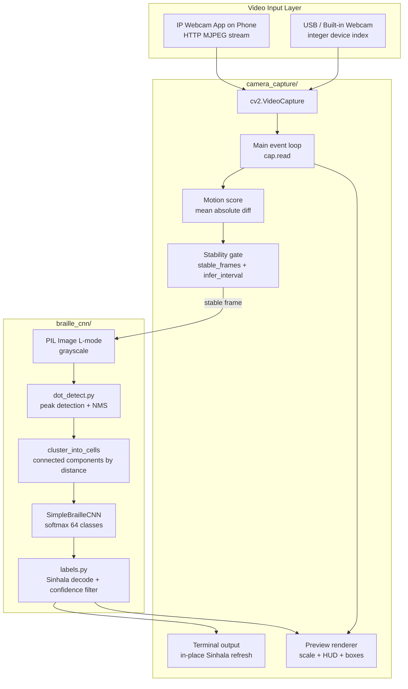

# BrailleLens — Live Camera Capture Module

This folder implements **Branch 2** and **Branch 3** of the BrailleLens implementation plan: a live video pipeline that captures frames from a phone or webcam, stabilises the feed, runs automatic Braille dot detection and CNN classification, and prints **Sinhala transcription** to the terminal in real time.

The module is intentionally **separate from** `braille_cnn/`. It is a thin **orchestration layer** that imports the existing inference stack (`infer_page.py`, `dot_detect.py`, `cnn.py`, `labels.py`) without duplicating model logic.

---

## Table of Contents

1. [Purpose](#purpose)
2. [Folder Structure](#folder-structure)
3. [System Architecture](#system-architecture)
4. [Libraries and Dependencies](#libraries-and-dependencies)
5. [Prerequisites](#prerequisites)
6. [How to Run](#how-to-run)
7. [End-to-End Pipeline (Technical)](#end-to-end-pipeline-technical)
8. [Integration with `braille_cnn`](#integration-with-braille_cnn)
9. [CLI Reference](#cli-reference)
10. [Keyboard Controls](#keyboard-controls)
11. [Output Channels](#output-channels)
12. [Motion Stability Algorithm](#motion-stability-algorithm)
13. [Transcription and Confidence Filtering](#transcription-and-confidence-filtering)
14. [Preview Window Rendering](#preview-window-rendering)
15. [Configuration Tuning Guide](#configuration-tuning-guide)
16. [Known Limitations](#known-limitations)
17. [Troubleshooting](#troubleshooting)

---

## Purpose

| Goal | How this module achieves it |
|------|-----------------------------|
| Live camera input | `cv2.VideoCapture` on integer index or HTTP MJPEG URL (IP Webcam) |
| Reduce flickering results | Frame-stability gate + minimum inference interval |
| Reuse trained CNN | Calls `run_auto_transcribe()` from `braille_cnn.infer_page` |
| Sinhala output | Default `--lang si`, two-cell vowel decoding, confidence threshold |
| Developer visibility | Detection bounding boxes, motion/FPS HUD, optional verbose logging |

---

## Folder Structure

```
camera_capture/
├── __init__.py       # Marks this directory as a Python package
├── camera.py         # Core capture loop, stability logic, preview HUD, terminal output
├── run_camera.py     # CLI entry point (argparse) — run this file to start live mode
└── README.md         # This document
```

| File | Responsibility |
|------|----------------|
| `run_camera.py` | Parses command-line arguments, resolves default checkpoint path, sets `args.auto = True`, delegates to `run_camera()` |
| `camera.py` | Opens video source, reads frames in a loop, applies motion gating, invokes inference, renders preview, prints Sinhala |
| `__init__.py` | Empty package marker; allows `from camera_capture.camera import run_camera` |

**Related files outside this folder:**

| Path | Role |
|------|------|
| `braille_cnn/infer_page.py` | `load_model()`, `run_auto_transcribe()` — dot detection, clustering, CNN inference, transcription assembly |
| `braille_cnn/dot_detect.py` | Peak detection and per-cell dot clustering on grayscale images |
| `braille_cnn/cnn.py` | `SimpleBrailleCNN` — 64-class Braille cell classifier |
| `braille_cnn/labels.py` | English/Sinhala label tables, indicator vowel pairs, `code_to_label()` |
| `braille_cnn/checkpoints/braille_cnn_dbsi_finetuned.pt` | Default PyTorch `state_dict` checkpoint (DBSI-trained) |

---

## System Architecture



### Layered design

1. **I/O layer** (`camera.py`) — hardware/stream access, UX, timing, display scaling.
2. **Inference layer** (`braille_cnn/`) — computer vision + deep learning; agnostic to whether input came from a file or camera.
3. **Label layer** (`labels.py`) — symbolic decoding from integer dot-pattern codes (0–63) to Unicode Sinhala graphemes.

The CNN is loaded **once at startup** via `load_model()` and passed into every `run_auto_transcribe()` call. This avoids reloading weights on each frame (a performance bug that existed before Branch 2).

---

## Libraries and Dependencies

### Direct imports in `camera_capture/`

| Library | Module | Purpose in this pipeline |
|---------|--------|--------------------------|
| **OpenCV** | `cv2` | `VideoCapture` (frame acquisition), `cvtColor` (BGR→grayscale), `absdiff` (motion metric), `resize` (preview downscale), `imshow`/`waitKey` (GUI loop), `rectangle`/`putText` (HUD overlays) |
| **NumPy** | `numpy` | Dense array representation of pixel buffers (`np.ndarray`, dtype `uint8`) |
| **PyTorch** | `torch` | Device selection (`cuda` / `cpu`); model object lives on this device (loaded in `braille_cnn`, referenced here) |
| **Pillow** | `PIL.Image` | Converts OpenCV grayscale array to `Image` in **L mode** (8-bit luminance) — the format `infer_page.py` expects |
| **stdlib** | `sys`, `time`, `pathlib` | `sys.path` bootstrap, FPS timing, checkpoint path resolution, ANSI terminal cursor control |

### Transitive dependencies (via `braille_cnn/`)

Listed in `braille_cnn/requirements.txt`:

| Package | Role |
|---------|------|
| `torch` | Tensor computation, CNN forward pass, `torch.load(..., weights_only=True)` |
| `torchvision` | Used elsewhere in training pipeline |
| `numpy` | Numerical arrays throughout CV pipeline |
| `Pillow` | Image crop/resize for per-cell CNN input tensors |
| `opencv-python` | Dot detection preprocessing in `dot_detect.py` |
| `scipy` | Used in dot detection / signal processing |
| `matplotlib` | Training/evaluation plotting (not required at runtime for camera) |

### Recommended Python environment

On this project, PyTorch is installed under **Python 3.11**. Use:

```bash
py -3.11 camera_capture/run_camera.py ...
```

Using a conda env without `torch` (e.g. `tensorflow_env`) will fail with `ModuleNotFoundError: No module named 'torch'`.

---

## Prerequisites

1. **Project root** as working directory (so imports and checkpoint paths resolve).
2. **Trained checkpoint** at:
   ```
   braille_cnn/checkpoints/braille_cnn_dbsi_finetuned.pt
   ```
   Generate with:
   ```bash
   py -3.11 -m braille_cnn.finetune_dbsi --scratch --dbsi-root "data DBSI/data"
   ```
3. **Camera source** — IP Webcam app running on phone, PC and phone on same Wi‑Fi.
4. **Dependencies installed** for Python 3.11 (`pip install -r braille_cnn/requirements.txt`).

---

## How to Run

### Full live Sinhala inference (default)

```bash
py -3.11 camera_capture/run_camera.py --source http://192.168.8.126:8080/video
```

Replace the IP with your phone's address from the IP Webcam app.

### Preview only (no model, test stream connection)

```bash
py -3.11 camera_capture/run_camera.py --source http://192.168.8.126:8080/video --preview-only
```

### Verbose logging (full scroll log per inference)

```bash
py -3.11 camera_capture/run_camera.py --source http://192.168.8.126:8080/video --verbose
```

### Alternative entry point

`braille_cnn/infer_page.py` also accepts `--camera`, which imports and calls the same `run_camera()` function:

```bash
py -3.11 -m braille_cnn.infer_page --camera --source http://192.168.8.126:8080/video --lang si
```

---

## End-to-End Pipeline (Technical)

Below is the exact sequence executed for **each frame** in the main loop (`run_camera()` in `camera.py`).

### Phase 0 — Startup (once)

| Step | Function | Detail |
|------|----------|--------|
| 0.1 | `load_model(checkpoint, device)` | Instantiates `SimpleBrailleCNN(num_classes=64)`, loads `state_dict` with `weights_only=True`, sets `eval()` mode |
| 0.2 | `_open_source(source)` | Creates `cv2.VideoCapture(int)` or `cv2.VideoCapture(url)` for MJPEG |
| 0.3 | `cv2.namedWindow(..., WINDOW_NORMAL)` | Resizable preview window (avoids 1:1 pixel blow-up on high-res phone streams) |

### Phase 1 — Frame acquisition (every iteration)

| Step | Function | Detail |
|------|----------|--------|
| 1.1 | `cap.read()` | Returns `(ret, frame)` where `frame` is BGR `numpy.ndarray` shape `(H, W, 3)` |
| 1.2 | `cv2.cvtColor(frame, COLOR_BGR2GRAY)` | Single-channel grayscale for motion metric |
| 1.3 | `_motion_score(prev_gray, gray_np)` | `mean(abs(curr - prev))` on 0–255 scale |

### Phase 2 — Stability gating

| Step | Logic | Detail |
|------|-------|--------|
| 2.1 | `motion <= motion_threshold` | Frame counted as **stable candidate** (default threshold: `8.0`) |
| 2.2 | `stable_streak` | Incremented on stable frames, reset to `0` on motion |
| 2.3 | Status `STABLE` | Only when `stable_streak >= stable_frames` (default: `8` consecutive frames) |
| 2.4 | Inference trigger | `(stable_streak >= stable_frames AND elapsed >= infer_interval)` OR user pressed **`S`** |

This **debounces** inference: the camera must be physically still for ~8 frames (~250 ms at 30 FPS) and at least `1.5 s` must pass since the last inference.

### Phase 3 — Inference (on trigger)

| Step | Function | Detail |
|------|----------|--------|
| 3.1 | `_frame_to_gray_pil(frame)` | BGR→gray→`PIL.Image` mode `L` at **full camera resolution** |
| 3.2 | `run_auto_transcribe(pil_image, args, model, device)` | See [Inference sub-pipeline](#inference-sub-pipeline-run_auto_transcribe) |
| 3.3 | `_print_live_output(result)` | Writes stats + Sinhala sentence to terminal (in-place or verbose) |

### Phase 4 — Preview rendering (every iteration)

| Step | Function | Detail |
|------|----------|--------|
| 4.1 | `_fit_for_display(frame, display_width)` | Downscales width to max `960 px` using `INTER_AREA`; returns `(preview, scale)` |
| 4.2 | `_draw_detections(preview, result, scale)` | Draws cluster bboxes (green/red) and CNN crop bboxes (orange), coordinates multiplied by `scale` |
| 4.3 | `_draw_overlay(...)` | Status bar (STABLE/MOVING, FPS, motion, streak, source resolution), ASCII stats lines |
| 4.4 | `cv2.imshow` + `cv2.waitKey(1)` | Non-blocking GUI event pump; reads keyboard shortcuts |

**Important:** Preview scaling affects **display only**. Inference always uses the **full-resolution** frame.

---

### Inference sub-pipeline (`run_auto_transcribe`)

Implemented in `braille_cnn/infer_page.py`. Returns a structured `dict` (no stdout parsing required).

#### Step A — Dot detection

```python
gray = np.asarray(image, dtype=np.float32)
points = detect_dot_centers(gray, percentile=dot_percentile, footprint=dot_footprint)
```

- Treats embossed dots as **local brightness peaks** on grayscale float image.
- `dot_percentile` (default `99.3`): adaptive threshold — only top ~0.7% contrast peaks survive.
- `dot_footprint` (default `9`): non-maximum suppression window (~one dot diameter in pixels).

#### Step B — Cell clustering

```python
clusters = cluster_into_cells(points, link_distance=link_distance)
```

- Groups nearby dot centers into **6-dot Braille cells** using a distance threshold (`link_distance`, default `15.0 px`).
- Clusters with ambiguous topology are flagged `merged=True` and **excluded** from classification (conservative — avoids guessing merged cells).

#### Step C — Per-cell cropping

- Estimates median cell width/height from valid multi-dot clusters.
- Builds a bounding box per valid cluster with margin `cell_margin_scale` (default `0.8`, matches DBSI training convention).
- Crops from PIL image, resizes to `img_size × img_size` (default `64×64`) with bicubic interpolation.

#### Step D — CNN classification

```python
batch = stack(normalized_grayscale_tensors)  # values in [0, 1]
logits = model(batch)
probs = softmax(logits, dim=1)
confidences, preds = probs.max(dim=1)
```

- **64-way softmax** — each output class is a unique 6-dot pattern (Braille code 0–63).
- `preds`: integer class index per cell.
- `confidences`: maximum softmax probability per cell.

#### Step E — Line grouping

```python
lines = _group_into_lines(valid_clusters)
```

- Sorts cluster centers by **y-coordinate**, splits into lines using **Otsu threshold** on vertical gaps.
- Within each line, sorts by **x-coordinate** (reading order).

#### Step F — Transcription assembly

```python
text_lines, sentence = _assemble_transcription(lines, valid, preds, confidences, lang, conf_threshold)
```

For each line, `_decode_line_with_confidence()`:

- Inserts **word spaces** when horizontal gap between cells exceeds `1.8 × median_gap`.
- For `lang=si`:
  - Handles **two-cell indicator pairs** (codes 60/61 + modifier) → combining Sinhala vowel signs.
  - Maps single cells via `CODE_TO_SINHALA`.
  - Code `0` (empty cell) → space character.
  - Confidence `< conf_threshold` (default `0.6`) → `_` placeholder.

Returns:

```python
{
    "num_dots": int,
    "num_clusters": int,
    "num_merged": int,
    "cell_size": (float, float),
    "lines": list[str],           # one string per braille line
    "sentence": str,              # lines joined with "\n"
    "num_valid_cells": int,
    "clusters": list[dict],
    "valid": list[dict],
    "boxes": list[tuple],
    "preds": torch.Tensor,
    "confidences": torch.Tensor,
    "grouped_lines": list[list],
}
```

---

## Integration with `braille_cnn`

```
camera_capture/run_camera.py
        │
        ▼
camera_capture/camera.py :: run_camera(args)
        │
        ├── load_model()          ──► braille_cnn/infer_page.py
        │
        └── run_auto_transcribe() ──► braille_cnn/infer_page.py
                    │
                    ├── dot_detect.py    (peak detection, clustering)
                    ├── cnn.py           (SimpleBrailleCNN forward pass)
                    └── labels.py        (Sinhala Unicode decoding)
```

**Design principle:** `camera_capture` never imports `dot_detect` or `cnn` directly. All CV/ML logic stays in `braille_cnn`, keeping a single source of truth for static-image and live-camera inference.

---

## CLI Reference

All arguments are defined in `run_camera.py`.

### Camera / display

| Flag | Default | Description |
|------|---------|-------------|
| `--source` | `http://192.168.1.x:8080/video` | Integer index (`0`, `1`, …) or HTTP MJPEG URL |
| `--preview-only` | off | Open stream without loading model or running inference |
| `--display-width` | `960` | Max preview width in pixels (display-only downscale) |
| `--verbose` | off | Print full log each inference instead of in-place terminal refresh |

### Stability / timing

| Flag | Default | Description |
|------|---------|-------------|
| `--motion-threshold` | `8.0` | Mean absolute pixel diff (0–255); below = stable frame |
| `--stable-frames` | `8` | Consecutive stable frames required before auto-inference |
| `--infer-interval` | `1.5` | Minimum seconds between two auto-inferences |

### Model / detection

| Flag | Default | Description |
|------|---------|-------------|
| `--checkpoint` | `braille_cnn/checkpoints/braille_cnn_dbsi_finetuned.pt` | PyTorch `state_dict` path (absolute path resolved from project root) |
| `--img-size` | `64` | CNN input crop size (pixels) |
| `--link-distance` | `15.0` | Max pixel distance to link dots into same cell |
| `--dot-percentile` | `99.3` | Brightness peak percentile cutoff for dot detection |
| `--dot-footprint` | `9` | NMS window size (~dot diameter) |
| `--cell-margin-scale` | `0.8` | Crop padding as fraction of measured cell span |

### Output language

| Flag | Default | Description |
|------|---------|-------------|
| `--lang` | `si` | `si` = Sinhala, `en` = English Grade-1 Braille labels |
| `--conf-threshold` | `0.6` | Softmax confidence below this → `_` in transcription |
| `--debug-out` | none | If set, saves PIL debug overlay PNG from last inference |

---

## Keyboard Controls

Focus the **"BrailleLens — Live Camera"** OpenCV window, then:

| Key | Action |
|-----|--------|
| **Q** | Quit — releases `VideoCapture`, destroys windows, prints final transcription |
| **S** | Force inference on current frame (bypasses stability gate once) |
| **D** | Toggle detection bounding boxes on preview |

---

## Output Channels

### 1. Terminal (primary Sinhala output)

OpenCV **cannot render Sinhala Unicode** reliably on Windows (`cv2.putText` uses a limited ASCII font). All Sinhala text is printed to **stdout**.

**Default mode (in-place refresh):**

- Line 1: timestamp + cell/line/dot counts
- Line 2: assembled Sinhala sentence (multi-line joined with ` | `)
- Uses carriage return `\r` and ANSI `\033[1A` to overwrite previous output

**Verbose mode (`--verbose`):**

- Prints a new block per inference (scroll log)

**On exit:**

- Prints `Final transcription:` with the last full multi-line Sinhala result.

### 2. Preview window (visual feedback only)

| Element | Colour | Meaning |
|---------|--------|---------|
| Status bar green | — | Camera stable enough for inference |
| Status bar blue | — | Camera moving |
| Green rectangles | — | Valid single-cell dot clusters |
| Red rectangles | — | Merged/uncertain clusters (not classified) |
| Orange rectangles | — | CNN crop regions sent to the network |
| ASCII HUD lines | green text | Cell count, average confidence, motion score |

---

## Motion Stability Algorithm

```
motion_score = mean(|I_t(x,y) - I_{t-1}(x,y)|)   # grayscale, all pixels

if motion_score <= motion_threshold:
    stable_streak += 1
else:
    stable_streak = 0

status = STABLE  iff  stable_streak >= stable_frames
```

| Parameter | Typical effect when increased |
|-----------|------------------------------|
| `motion_threshold` | More tolerant of hand shake → easier to reach STABLE |
| `stable_frames` | Requires longer stillness → fewer false triggers |
| `infer_interval` | Less frequent inference → less CPU load, less flicker |

---

## Transcription and Confidence Filtering

### Braille code → Unicode

Each CNN output is an integer **0–63** representing a 6-dot pattern:

```
code = Σ (1 << (dot_index - 1))  for each raised dot
```

Example: dots {1, 2, 5} → code 19 → Sinhala `ක` (when mapped in `CODE_TO_SINHALA`).

### Confidence gating

After softmax:

```
if confidence < conf_threshold:
    emit "_"
else:
    emit decoded Sinhala character (or indicator pair)
```

This suppresses low-certainty guesses from phone-camera noise.

### Two-cell Sinhala indicators

Sinhala Braille uses **indicator cells** (codes 60 and 61) followed by a modifier cell to produce combining vowel signs. `_decode_line_with_confidence()` handles these pairs before falling back to single-cell lookup.

---

## Preview Window Rendering

```
full_res_frame (e.g. 1920×1080 BGR)
        │
        ├─► run_auto_transcribe(full_res PIL gray)     ← inference path
        │
        └─► _fit_for_display(max_width=960)
                │
                ├─► _draw_detections(scale = 960/w)
                └─► _draw_overlay(FPS, motion, ASCII stats)
                        │
                        └─► cv2.imshow()
```

Scaling uses `cv2.INTER_AREA` (appropriate for downscaling). Bounding box coordinates from inference are multiplied by `scale` so overlays align with the scaled preview.

---

## Configuration Tuning Guide

| Symptom | Try |
|---------|-----|
| Preview looks zoomed/cropped | Increase `--display-width 1280` |
| Never reaches STABLE | Increase `--motion-threshold 12` or decrease `--stable-frames 5` |
| Results flicker too fast | Increase `--infer-interval 2.5` or `--stable-frames 12` |
| Too many `_` placeholders | Lower `--conf-threshold 0.45` |
| Too much garbage text | Raise `--conf-threshold 0.75` |
| No dots detected | Lower `--dot-percentile 98.5`, improve lighting, move closer |
| Cells merging wrongly | Lower `--link-distance 12` |
| Stream won't open | Verify IP Webcam URL, same Wi‑Fi, firewall |

---

## Known Limitations

1. **Domain gap:** The default checkpoint is trained on **DBSI flatbed scans** (~99% accuracy there). Handheld phone camera footage has different blur, perspective, and lighting — expect lower real-world accuracy until fine-tuned on phone captures.
2. **Sinhala in preview:** Not supported by OpenCV font rendering; use terminal output.
3. **Single-threaded loop:** Capture, inference, and display run sequentially on one thread; large frames on CPU can reduce FPS.
4. **MJPEG decode warnings:** `[mjpeg @ ...] overread` messages from FFmpeg backend are usually harmless IP Webcam stream artefacts.
5. **`--debug-out`:** Passed through `args` but debug PNG saving is implemented in `run_auto()` (not `run_auto_transcribe()`); camera mode currently uses `run_auto_transcribe()` directly — use static `infer_page.py --auto --image ... --debug-out` for saved overlays unless wired separately.

---

## Troubleshooting

| Error | Cause | Fix |
|-------|-------|-----|
| `ModuleNotFoundError: torch` | Wrong Python env | Use `py -3.11`, not conda env without torch |
| `Checkpoint not found` | Model not trained | Run `finetune_dbsi` (see Prerequisites) |
| `Could not open camera source` | IP Webcam not running / wrong IP | Start app, copy exact `/video` URL |
| `(no braille lines detected)` | No peaks/clusters in frame | Point at Braille, improve lighting, press **S** |
| Garbled green text on video | Sinhala in OpenCV overlay | Read terminal instead (by design) |
| Window frozen | Inference blocking loop | Normal on CPU with many cells; wait or reduce resolution in IP Webcam app |

---

## Version History (implementation branches)

| Branch | Status | Delivered in this folder |
|--------|--------|--------------------------|
| Branch 2 — `feat/camera-capture` | Done | VideoCapture loop, grayscale conversion, motion gate, model loaded once, `--preview-only` |
| Branch 3 — `feat/live-sinhala-output` | Done | Default `--lang si`, confidence threshold, in-place terminal refresh, structured `run_auto_transcribe()` API |

---

## Quick Reference Command

```bash
# Standard live Sinhala test (IP Webcam on phone)
py -3.11 camera_capture/run_camera.py --source http://YOUR_PHONE_IP:8080/video
```

Hold the camera steady over a Braille page until the status bar turns **green (STABLE)**, then read the Sinhala output in the **terminal**.
