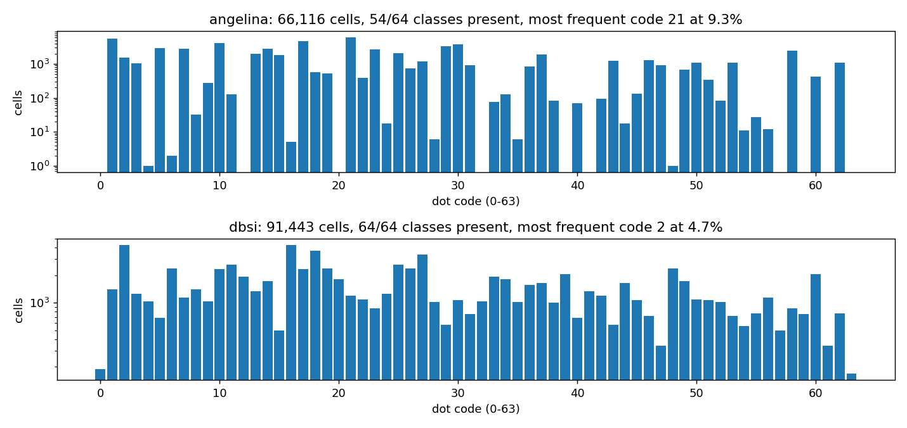
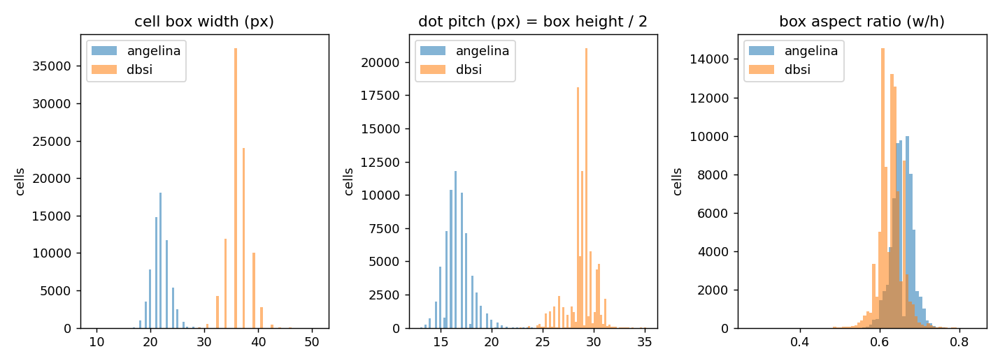
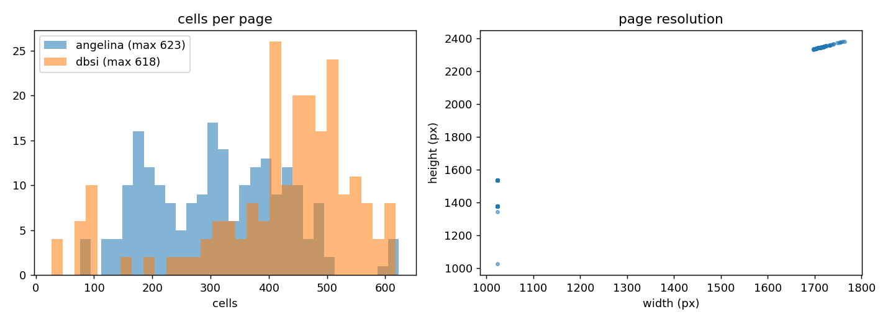
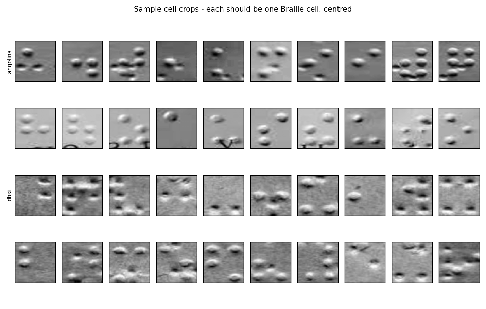
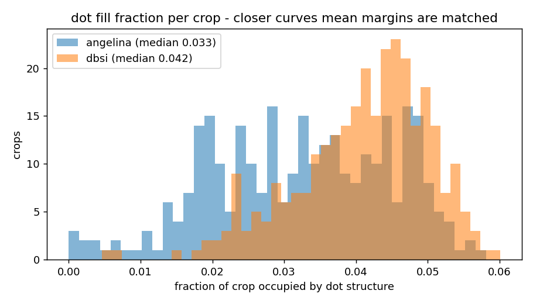
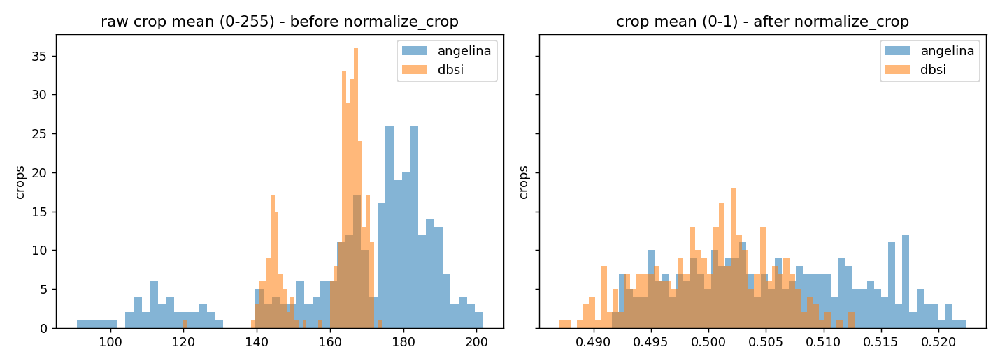

# Stage 3 - exploratory data analysis

## Dataset totals

| Source | Cells | Images | Page groups | Classes present |
|---|---:|---:|---:|---:|
| angelina | 66,116 | 212 | 212 | 54/64 |
| dbsi | 91,443 | 220 | 114 | 64/64 |

## Split integrity

| Source | train | val | test |
|---|---:|---:|---:|
| angelina | 52,830 | 13,286 | 0 |
| dbsi | 20,193 | 0 | 71,250 |

Page groups spanning more than one split: **0** (OK).

## Class imbalance

- **angelina**: most frequent code 21 holds 9.3% of cells; ratio between most and least frequent present class is 6,150x; 10 codes never appear.
- **dbsi**: most frequent code 2 holds 4.7% of cells; ratio between most and least frequent present class is 26x; 0 codes never appear.

This is what justifies class weighting in training and the `--cap-per-class` option in Stage 2c.

## Geometry and domain gap

| Source | Median box w x h (px) | Median dot pitch (px) | Median page (px) | Median dot fill |
|---|---|---:|---|---:|
| angelina | 22 x 33 | 16.5 | 1024 x 1376 | 0.033 |
| dbsi | 36 x 58 | 28.9 | 1704 x 2340 | 0.042 |

## Detector sizing

Cells per page: median 393, 95th percentile 566, max 623. Set the cell detector's `max_det` above the max, not above the median.

## Figures

### class_distribution.png

### cell_geometry.png

### page_layout.png

### crop_samples.png

### dot_fill.png

### brightness.png

